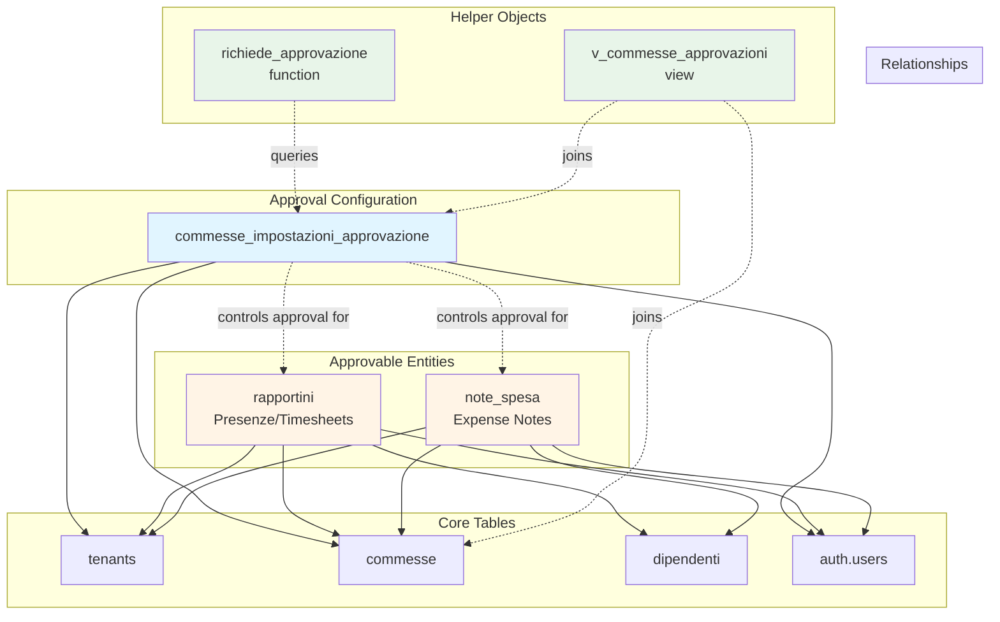
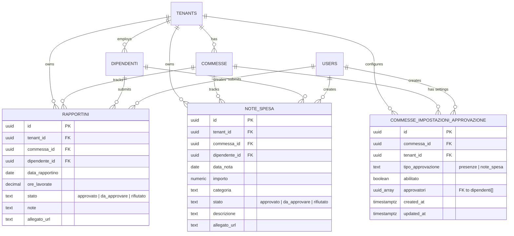
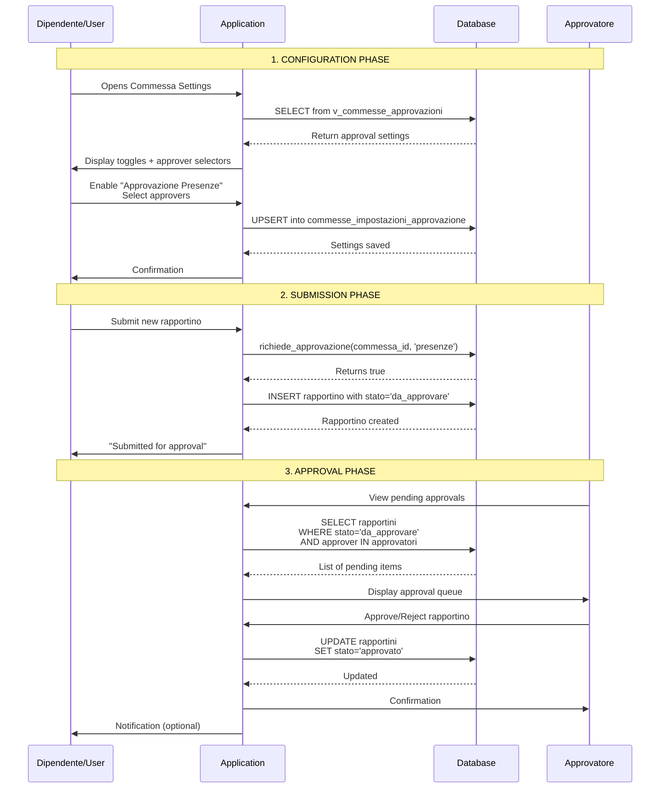
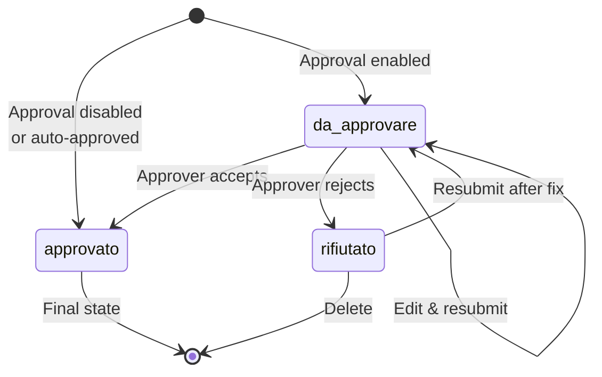

# Approval System - Architecture Overview

## System Architecture Diagram



## Entity Relationship Diagram



## Data Flow: Approval Workflow



## State Machine: Approval States



## Database Schema Layers

```
┌─────────────────────────────────────────────────────┐
│                  APPLICATION LAYER                   │
│  - Next.js Pages                                     │
│  - React Components                                  │
│  - API Routes                                        │
└──────────────────┬──────────────────────────────────┘
                   │
                   ▼
┌─────────────────────────────────────────────────────┐
│               SUPABASE CLIENT LAYER                  │
│  - supabase.from('table').select()                   │
│  - supabase.rpc('function')                          │
│  - Real-time subscriptions                           │
└──────────────────┬──────────────────────────────────┘
                   │
                   ▼
┌─────────────────────────────────────────────────────┐
│                   VIEW LAYER                         │
│  - v_commesse_approvazioni (denormalized)            │
│  - v_pending_approvals (future)                      │
└──────────────────┬──────────────────────────────────┘
                   │
                   ▼
┌─────────────────────────────────────────────────────┐
│                 FUNCTION LAYER                       │
│  - richiede_approvazione(commessa_id, tipo)          │
│  - get_pending_approvals_count(dipendente_id)        │
└──────────────────┬──────────────────────────────────┘
                   │
                   ▼
┌─────────────────────────────────────────────────────┐
│                   TABLE LAYER                        │
│  Core Tables:                                        │
│    - tenants                                         │
│    - commesse                                        │
│    - dipendenti                                      │
│    - auth.users                                      │
│                                                      │
│  Approval Tables:                                    │
│    - commesse_impostazioni_approvazione              │
│    - rapportini (with stato)                         │
│    - note_spesa (new, with stato)                    │
└──────────────────┬──────────────────────────────────┘
                   │
                   ▼
┌─────────────────────────────────────────────────────┐
│                  SECURITY LAYER                      │
│  - Row Level Security (RLS) Policies                 │
│  - tenant_id isolation                               │
│  - created_by validation                             │
└─────────────────────────────────────────────────────┘
```

## Approval Configuration Patterns

### Pattern 1: Simple Single Approver
```
Commessa: "Cantiere Milano"
  ├─ Approvazione Presenze: ✓ Enabled
  │   └─ Approvatori: [Mario Rossi (Capocantiere)]
  └─ Approvazione Note Spesa: ✓ Enabled
      └─ Approvatori: [Maria Bianchi (HR)]
```

### Pattern 2: Multiple Approvers (Any Can Approve)
```
Commessa: "Progetto Roma"
  ├─ Approvazione Presenze: ✓ Enabled
  │   └─ Approvatori: [
  │         Giuseppe Verdi (Capo),
  │         Laura Neri (Project Manager),
  │         Franco Blu (HR)
  │       ]
  └─ Approvazione Note Spesa: ✗ Disabled
```

### Pattern 3: Mixed Configuration
```
Tenant: ABC Costruzioni
  ├─ Commessa A: Both approvals enabled
  ├─ Commessa B: Only presenze approval
  ├─ Commessa C: Only note_spesa approval
  └─ Commessa D: No approvals (auto-approve)
```

## Query Performance Strategy

### Index Usage by Query Type

| Query Type | Index Used | Performance |
|------------|------------|-------------|
| Get commessa settings | `idx_approvazione_commessa` | O(log n) |
| List tenant approvals | `idx_approvazione_tenant` | O(log n) |
| Filter by approval type | `idx_approvazione_tipo` | O(log n) |
| Check if user is approver | `idx_approvazione_approvatori` (GIN) | O(1) |
| Pending presenze | `idx_rapportini_stato` + `idx_rapportini_tenant` | O(log n) |
| Pending note_spesa | `idx_note_spesa_stato` + `idx_note_spesa_tenant` | O(log n) |
| Date range queries | `idx_note_spesa_tenant_data` (composite) | O(log n) |

### Caching Strategy

**Application Level:**
- Cache approval settings per commessa (TTL: 5 minutes)
- Invalidate on settings update
- Use React Query or SWR for client-side caching

**Database Level:**
- PostgreSQL query plan caching (automatic)
- Materialized views for complex aggregations (if needed)

## Scalability Considerations

### Current Design Supports:

| Metric | Capacity | Notes |
|--------|----------|-------|
| Tenants | 10,000+ | RLS ensures isolation |
| Commesse per tenant | 10,000+ | Indexed queries remain fast |
| Approvers per commessa | 50 | Array-based, GIN indexed |
| Rapportini per month | 1M+ | Partitioning recommended at 10M+ |
| Note spesa per month | 500K+ | Same as rapportini |

### When to Optimize Further:

1. **Approvers > 100**: Create `commesse_approvatori` join table
2. **Records > 10M**: Implement table partitioning by date
3. **Real-time needs**: Add PostgreSQL NOTIFY/LISTEN for instant updates
4. **Audit requirements**: Add `approvazioni_log` table for history

## Security Boundaries

```
┌─────────────────────────────────────────────────────┐
│                   TENANT ISOLATION                   │
│  Every query filtered by tenant_id via RLS           │
└──────────────────┬──────────────────────────────────┘
                   │
                   ▼
┌─────────────────────────────────────────────────────┐
│                 ROLE-BASED ACCESS                    │
│  - created_by must match auth.uid() on INSERT        │
│  - Admin role can UPDATE/DELETE all tenant data      │
│  - Regular users can UPDATE own submissions          │
└──────────────────┬──────────────────────────────────┘
                   │
                   ▼
┌─────────────────────────────────────────────────────┐
│               APPROVAL AUTHORIZATION                 │
│  Only dipendenti in approvatori[] can approve        │
│  Application enforces this via UI + API logic        │
└─────────────────────────────────────────────────────┘
```

## Technology Stack

| Component | Technology | Purpose |
|-----------|-----------|---------|
| Database | PostgreSQL 15+ | Core data storage |
| Auth | Supabase Auth | User authentication |
| RLS | PostgreSQL RLS | Row-level security |
| ORM | Supabase Client | Type-safe queries |
| Frontend | Next.js + React | UI framework |
| State Management | React Query / SWR | Client-side caching |

## Integration Points

### 1. Commessa Detail Page - Impostazioni Tab

```typescript
// components/commessa/ImpostazioniTab.tsx
interface ApprovalSettings {
  presenze: {
    enabled: boolean;
    approvers: string[]; // dipendente UUIDs
  };
  note_spesa: {
    enabled: boolean;
    approvers: string[];
  };
}

// Fetch settings
const { data: settings } = useQuery(['approval-settings', commessaId], () =>
  supabase
    .from('commesse_impostazioni_approvazione')
    .select('*')
    .eq('commessa_id', commessaId)
);

// Update settings
const mutation = useMutation((settings: ApprovalSettings) =>
  // Upsert both configs
  Promise.all([
    supabase.from('commesse_impostazioni_approvazione').upsert({
      commessa_id: commessaId,
      tipo_approvazione: 'presenze',
      abilitato: settings.presenze.enabled,
      approvatori: settings.presenze.approvers
    }),
    // ... same for note_spesa
  ])
);
```

### 2. Rapportini/Note Spesa Creation

```typescript
// Before insert, check if approval required
const { data: requiresApproval } = await supabase.rpc(
  'richiede_approvazione',
  { p_commessa_id: commessaId, p_tipo_approvazione: 'presenze' }
);

const stato = requiresApproval ? 'da_approvare' : 'approvato';
```

### 3. Approval Dashboard

```typescript
// Get pending approvals for current user
const { data: pendingPresenze } = useQuery(['pending-presenze'], () =>
  supabase
    .from('rapportini')
    .select(`
      *,
      dipendente:dipendenti(*),
      commessa:commesse(*)
    `)
    .eq('stato', 'da_approvare')
    .in('commessa_id', myApprovalCommessaIds)
);
```

## Future Enhancements

1. **Approval History Tracking**
   - Who approved/rejected
   - When action was taken
   - Rejection reasons

2. **Email Notifications**
   - Notify approvers of pending items
   - Notify submitter of approval/rejection

3. **Escalation Rules**
   - Auto-approve after X days
   - Escalate to secondary approver

4. **Approval Analytics**
   - Average approval time
   - Rejection rate by category
   - Approver workload metrics

5. **Batch Approvals**
   - Approve multiple items at once
   - Bulk actions UI

6. **Mobile App Support**
   - Push notifications
   - Quick approve/reject actions
